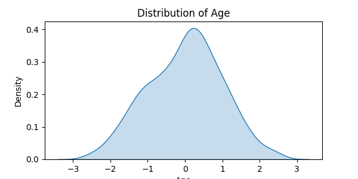
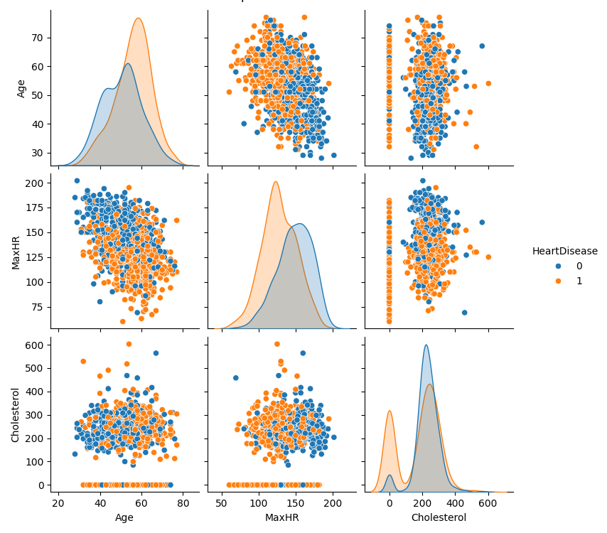
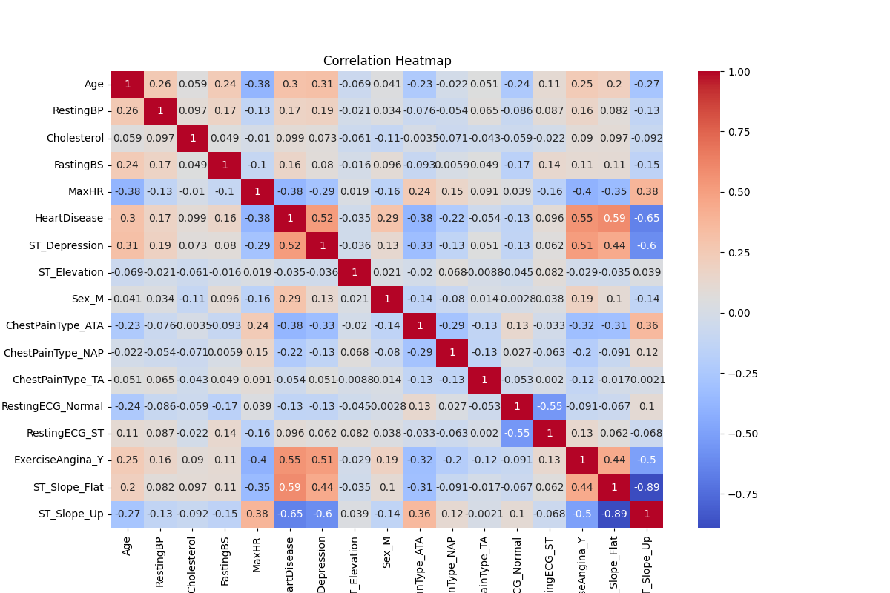
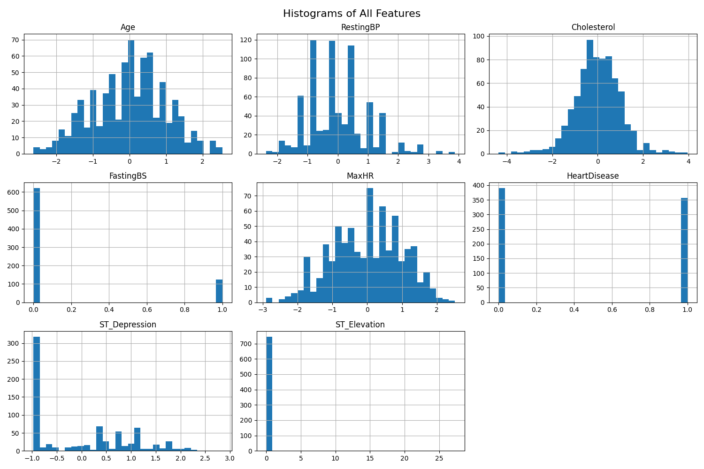
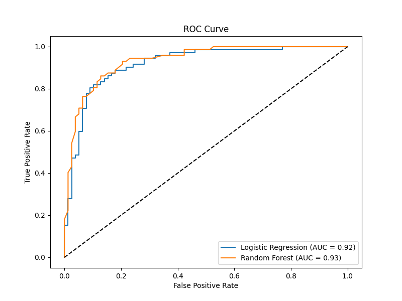

# Heart Disease Prediction using Machine Learning

## Project Overview
This project builds a machine learning model to predict the presence of heart disease using clinical patient data.

The goal is to demonstrate a complete machine learning workflow including data preprocessing, exploratory data analysis, feature engineering, model training, and evaluation.

---

## Objective
Early detection of heart disease is critical for improving patient outcomes.  
This project aims to develop a predictive model that can help identify individuals at risk based on clinical features.

---

## Dataset
The dataset contains medical attributes such as:

- Age
- Sex
- Chest pain type
- Blood pressure
- Cholesterol levels
- Maximum heart rate
- ST depression
- Other clinical measurements

The dataset is commonly used in machine learning research for heart disease prediction.

---

## Tools & Technologies

- Python
- Pandas
- NumPy
- Scikit-learn
- Matplotlib
- Seaborn
- Jupyter Notebook

---

## Methodology

1. Data Cleaning
2. Exploratory Data Analysis
3. Feature Engineering
4. Train/Test Split
5. Model Training
6. Model Evaluation

Machine learning algorithms tested:

- Logistic Regression
- Random Forest
- Support Vector Machine
- K-Nearest Neighbors

---

## Results

The models were evaluated using classification metrics such as:

- Accuracy
- Precision
- Recall
- F1-score

The best-performing model achieved strong predictive performance on the test dataset.

---

## Exploratory Data Analysis

### Feature Distributions



Understanding how key variables such as age are distributed helps identify patterns and potential relationships with heart disease.

---

### Feature Relationships



Pairwise relationships between features highlight correlations and potential predictive patterns in the dataset.

---

### Correlation Analysis



The correlation matrix helps identify which clinical variables have stronger relationships with heart disease.

---

### Feature Histograms



Distribution plots of numerical variables provide insight into the spread and skewness of the dataset.

---

## Model Performance



The ROC curve compares model performance.  
Random Forest achieved the best performance with **AUC ≈ 0.93**, outperforming Logistic Regression.

## Project Structure

```
heart-disease-prediction-ml
│
├── data
├── notebooks
├── images
├── README.md
```

---

## How to Run

1. Clone the repository

```
git clone https://github.com/goldteaa/heart-disease-prediction-ml.git
```

2. Install dependencies

```
pip install pandas numpy scikit-learn matplotlib seaborn
```

3. Run the notebook in Jupyter

---

## Future Improvements

- Hyperparameter tuning
- Cross-validation
- Model explainability (SHAP / feature importance)
- Deploy the model as a web application
